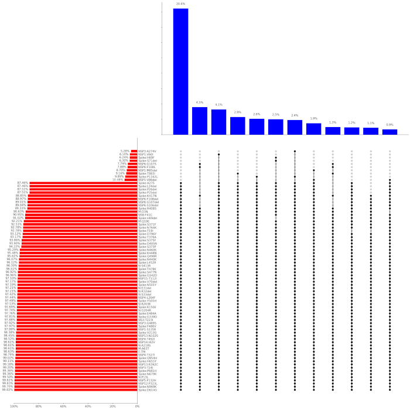

# plot-combinations

Plots frequent combinations of AA substitutions.


Input is a text file with AA substitutions from GISAID metadata dump (only "AA substitutions" column).

Output: png image, log file, calculated data in json file.

```
Usage: plot_combinations [OPTIONS] FILE

  Plot combinations of AA substitutions.

Options:
  -o, --output TEXT          Output base filename
  --min-sub-freq FLOAT       Min substitution frequency  [default: 0.05]
  --max-combi-cumfrac FLOAT  Max combination cum fraction
  --min-combi-freq FLOAT     Min combination frequency  [default: 0.05]
  --max-combi-num INTEGER    Max combination number  [default: 20]
  --size TEXT                Fig size  [default: 20x20]
  --top-font-size INTEGER    [default: 10]
  --help                     Show this message and exit.
```